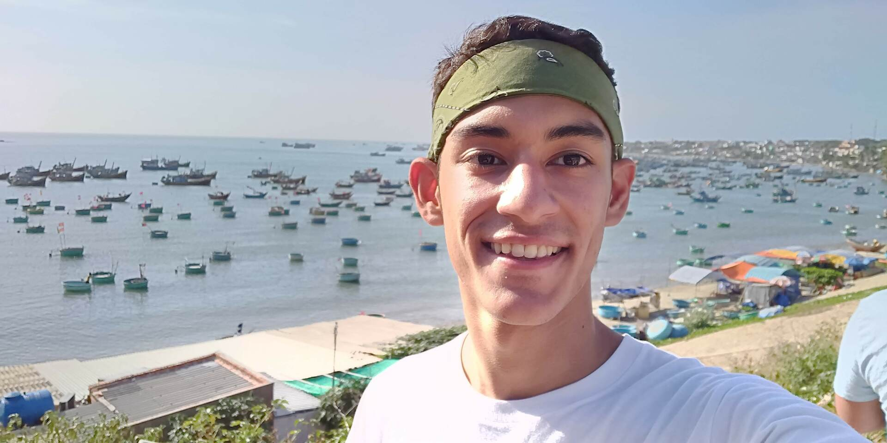

---
# Feel free to add content and custom Front Matter to this file.
# To modify the layout, see https://jekyllrb.com/docs/themes/#overriding-theme-defaults
layout: home
---
# Welcome to my site! 

My name is Andrés Ponce. I was born and grew up in Honduras and currently live and work in Taipei, Taiwan.
I did my master's degree in computer science at National Cheng Kung University under Professor Kuo Yau Hwang (郭耀煌).
I did my undergraduate degree at National Yang Ming Chiao Tung University.

